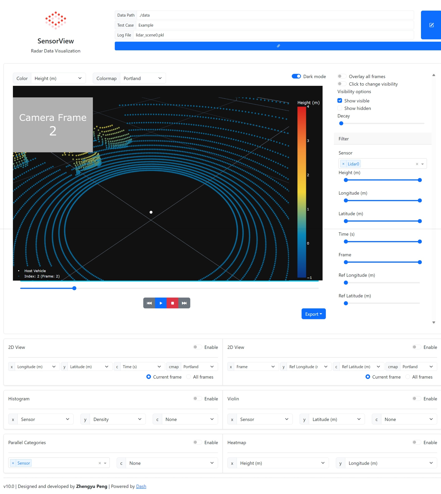

# SensorView

## Features

### 3D Visualization and Filtering

### 2D Visualization and Filtering

### Statistical Visualization

## Dependence

### Python modules

See `requirements.txt`

## Usage

Save data as the `.pkl` or `.csv` files under `./data` directory. See `./data/Example`.

Put the `config.json` in the same directory, and specify the `columns` of the data in `config.json`. Check `./data/Example/config.json`.
