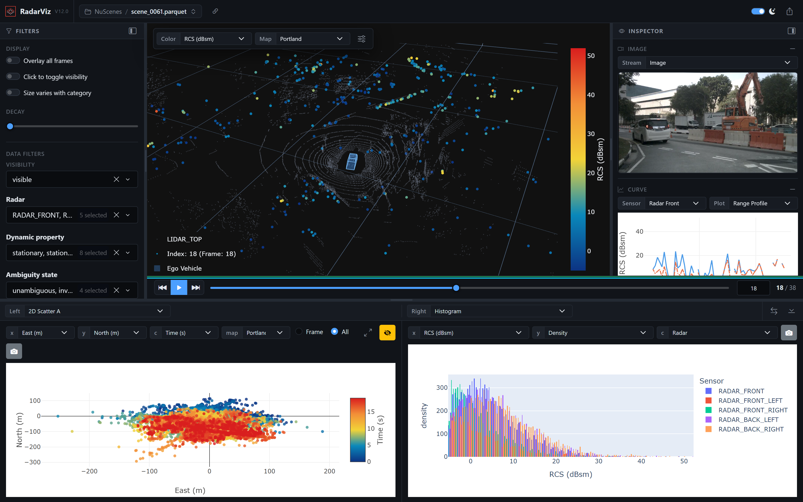
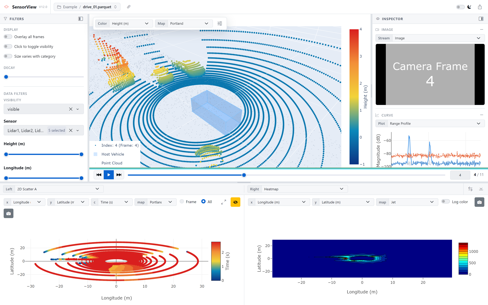

# SensorView


A Flask/Dash workbench for exploring multi-sensor logs. Its core purpose is
data analysis across three axes: **filtering** the frame table down to the
data that matters, **multi-dimensional inspection** of the same instant
through a 3D point cloud, camera frame, and 1D curves side by side, and
**statistical analysis** via six linked views — all driven by one frame
slider and one set of filters.

## Screenshots

The workbench on a nuScenes scene: the radar point cloud with its decimated
lidar backdrop and the ego-vehicle overlay, the camera frame and range profile
for the same instant in the inspector, and two statistical views in the dock.



<details>
<summary>Light theme</summary>



</details>

## The Workbench

Everything is sized against the viewport rather than flowing down a page.
Nothing scrolls except panel interiors, so no view is ever more than a click
from visible — which is the point, since all of them describe the same frame.

| Region | Holds |
|---|---|
| **Top bar** | Dataset breadcrumb (it *is* the file picker), combine-logs, theme toggle, export menu |
| **Left rail** | Display options and the per-column filters built from the manifest |
| **Canvas** | The 3D point cloud — the only region that grows |
| **Inspector** | The camera stream and the curve plot for the current frame |
| **Transport** | Frame scrubbing, playback, buffering progress |
| **Analysis dock** | Two slots, each showing any one of the six statistical views |

The rail, inspector, and dock each have a splitter on their inner edge; whatever
they give up, the canvas takes. Collapse, drag, and theme all run clientside
(`assets/workbench.js`) — none of it is anything the server knows about.

### 3D Canvas

Interactive 3D scatter with color mapping, a decay slider that fades previous
frames in behind the current one, and an overlay mode that draws every frame at
once. View settings float over the plot instead of docking above it, since
they're touched only a few times a session. Axis and reference-column mapping
live behind the sliders button.

### Filter Rail

Filters are generated per column from the manifest — a range slider for each
numerical key, a multi-select for each categorical one. Every view reads the
same filtered table, so a filter change moves all of them together. Points can
be relabelled *hidden* by clicking or lassoing them, then filtered on that
label.

### Inspector

The camera stream and curve plot for the current frame, docked on the right.
Each section has its own minimize toggle and restores from a chip in the panel
bar; the curve section grows into whatever height the image gives up. Sections
hide independently, and the whole inspector hides when a log has neither
sidecar, so the canvas reclaims the width.

### Analysis Dock

Two side-by-side slots over a drag-resizable panel that collapses to its own
header. Each slot shows one of six views:

- **2D Scatter A / B** — two independent x/y/color mappings, with lasso and box
  selection wired to the visibility label
- **Histogram** — one column binned, normalized as density or probability,
  optionally split by a category
- **Violin** — distribution by category
- **Parallel Categories** — categorical relationships
- **Heatmap** — 2D density

Slot assignment is the enable switch: a view in a slot is live, everything else
is idle, and a collapsed dock computes nothing.

### Transport and Buffering

The frame slider is the single source of truth for time: the video element
never plays on its own, it's seeked to whatever frame the rest of the app
shows, and playback runs the same path. Server- and browser-side buffering
progress ride as two hairlines on the transport's top edge, visible when
looked for.

### Other

- **Multiple File Support**: combine additional logs from the top bar and
  compare them in one view
- **Session Isolation**: each browser session gets its own cache namespace
- **Data Buffering**: a WebWorker pre-fetches frames into IndexedDB so scrubbing
  does not wait on the server
- **Dark/Light Theme**: chrome and Plotly templates switch together; the choice
  persists in `localStorage`
- **Export**: current plot as PNG or HTML, all frames as an HTML video, or the
  filtered data itself as Parquet for the current frame or all frames

---

## Data Architecture

Each kind of sensor data gets the storage format that suits its shape, joined by
a single **frame id**:

| Data | Format | Filterable | Updates on |
|---|---|---|---|
| Table (`table`) | Parquet (tidy table) | **Yes** — full filter pipeline | filter changes + frame changes |
| Cloud (`cloud`) | HDF5, pre-decimated | No — fixed backdrop | frame changes only |
| Curves (`curve`) | HDF5, one (N, 2) pair per frame | No | frame changes only |
| Images (`image`) | mp4, all-intra | No | frame changes only |
| Reference pose (`reference`) | Parquet, one row per frame | No | frame changes only |

The reasoning behind the split:

- **The table is the only queried dataset**, so it stays columnar: Parquet gives
  compression plus projection/predicate pushdown, and MATLAB reads it natively
  (`parquetread`/`parquetwrite`).
- **Cloud and curves are display-only**, frame-indexed blobs — nobody queries
  them by column, so a chunked HDF5 dataset per frame (equally native in
  MATLAB via `h5read`) beats Parquet's columnar overhead.
- **Clouds arrive pre-decimated**; the backdrop has no runtime controls, so no
  full-resolution data is kept on the read path.
- **Images are seeked client-side** via a native `<video>` element and
  `currentTime`, so scrubbing costs no server round trip. All-intra encoding
  lets the browser seek to any frame; a container it can't play (a vendor
  `.avi` off a logger) is transcoded once, on first request, and cached under
  `cache/video`.
- **Reference pose is per frame, not per detection** — six extra columns on
  every one of a log's 300k rows to say where one vehicle was would be
  wasteful, and table columns can't express orientation anyway.

Because the display-only views never depend on filter state, dragging a filter
slider re-renders the table alone — it never re-reads the cloud, curves, pose, or
video.

**SensorView reads these files; it does not write them.** Producing the layout
is the job of whatever exports the data — what follows is the complete
specification, and `data/NuScenes/build_nuscenes_case.py` is a working
converter for a real dataset.

---

# Data Format Reference

Everything below is the on-disk contract. It is written to be enough to build a
converter from any source format without reading the application code: exact
filenames, exact HDF5 paths, exact dtypes, and what each manifest key does.
[Writing a Converter](#writing-a-converter) has a worked example and a
validation checklist.

## At a Glance

```
data/MyCase/                     ← a "case": one info.json, any number of logs
├── info.json                    ← manifest v2, describes the case
├── drive_01.parquet             ← log "drive_01": the filterable table  (REQUIRED)
├── drive_01.cloud.h5            ←   point-cloud backdrop                (optional)
├── drive_01.curve.h5            ←   1D curves, default source           (optional)
├── drive_01.sensor_2.h5         ←   1D curves, a second named source    (optional)
├── drive_01.mp4                 ←   default image stream                (optional)
├── drive_01.rear.mp4            ←   a second, named image stream        (optional)
├── drive_01.reference.parquet   ←   per-frame reference pose            (optional)
├── drive_02.parquet             ← log "drive_02": same conventions
└── drive_02.mp4
```

| Store | Type | Where | Shape |
|---|---|---|---|
| Table | Parquet | `<stem>.parquet` | one row per point per frame, scalar columns |
| Cloud | HDF5 | `<stem>.cloud.h5` | one dataset per frame, `float32 (N, 3+)` |
| Curve | HDF5 | `<stem>.curve.h5` | one dataset per (frame, series), `float32 (N, 2)` |
| Image | mp4 | `<stem>.mp4` | H.264, yuv420p, all-intra |
| Pose | Parquet | `<stem>.reference.parquet` | one row per frame: `frame x y z yaw pitch roll` |
| Manifest | JSON | `info.json` | column metadata + sidecar conventions |

Adding a log is dropping files in the folder — there is nothing to register.
Every sidecar is optional; panels for missing data hide themselves.

## Vocabulary

| Term | Meaning |
|---|---|
| **case** | A folder holding one `info.json` and one or more logs. This is what you pick in the open dialog. |
| **log** | One recording: a table plus whatever sidecars share its basename. Selecting a log swaps its cloud, curves, pose, and video together. |
| **stem** | A log's basename with the table suffix removed — `drive_01.parquet` → `drive_01`. Every sidecar of that log starts with this exact string. |
| **frame id** | A value from the table's slider column. The join key across every store. |
| **frame index** | The 0-based position of a frame id in the sorted unique list. This is what the slider reports and what the URL routes take. |
| **source id** | Which curve sidecar (i.e. which sensor) a curve plot is read from. |
| **stream id** | Which video file an image panel plays. |

## File Naming and Association

Files are associated by **basename**. There are no subfolders and no per-file
entries in the manifest.

```
stem         = basename(<table file>) with ".parquet" removed
cloud file   = <stem><cloud.suffix>                    exactly one per log
curve files  = <stem><suffix>            → source id derived from the suffix
               <stem>.<id><suffix>       → source id = <id>
image files  = <stem><suffix>            → stream id "image" (the default stream)
               <stem>.<id><suffix>       → stream id = <id>
pose file    = <stem><reference.suffix>                exactly one per log
```

Rules a converter has to respect:

- **The table must sit at the top level of the case folder.** Sidecars resolve
  against the case directory, not against the table's own directory. The file
  picker will list a table found in a subfolder, but that log's sidecars will
  not be found.
- **`<stem>.<id>` uses a dot separator.** `drive_01_rear.mp4` is not a second
  stream of `drive_01`; it is a stream of a log called `drive_01_rear`. A file
  whose name continues past the stem with anything other than `.` is skipped as
  belonging to a different log that merely shares a prefix.
- **Source and stream ids come from the filename, not the manifest.** Dropping
  `drive_01.sensor_6.h5` into the folder adds a sixth curve source with no
  manifest edit. `_` in an id becomes a space in the picker label
  (`radar_front_left` → "Radar Front Left").
- **The default curve source's id is derived from its suffix**: `.curve.h5` →
  `curve`, `.radar_front.h5` → `radar_front`, a bare `.h5` → `curve`. Both
  `drive_01.radar_front.h5` matched by a generic `.h5` and a declared
  `.radar_front.h5` suffix therefore give the same id.
- **First declared suffix wins.** When a file matches more than one suffix, the
  earliest one in the `suffix` list claims it — which is why the default image
  suffix list is `[".mp4", ".avi"]`: a stream shipped in both containers serves
  the mp4 and skips the transcode.
- **Generic curve suffixes skip other sidecars.** A `suffix` of `".h5"` would
  otherwise swallow `drive_01.cloud.h5`; the cloud and table suffixes are
  excluded unless they are themselves listed in `curve.suffix`.
- **The pose sidecar is Parquet like the table**, so it is named out of the file
  picker by its suffix. A file ending in `reference.suffix` (default
  `.reference.parquet`) is never offered as a log.

Use a `suffix` **list** when the folder holds `.h5` files that are not curves,
or when the picker should list sensors in a chosen order rather than
alphabetically:

```json
"curve": { "suffix": [".radar_front.h5", ".radar_front_left.h5", ".lidar.h5"] }
```

## The Frame ID Contract

This is the single most important thing to get right: every store is joined by
frame id, and nothing validates the join for you — a mismatch shows up as an
empty backdrop or a motionless video, not as an error.

**The frame index is derived from the table, never declared in the manifest.**
That is deliberate: a manifest cannot drift out of sync with the data it
describes, and re-exporting a log needs no manifest edit.

```python
frame_ids  = sorted(table[slider].unique())      # the frame ids, ascending
timestamps = [t - t0 for t in per-frame min(Time)] * time_scale   # seconds, first frame at 0
```

- When there is no `Time` column (or it contains nulls), timestamps fall back to
  `index / 10.0`.
- Frame ids do **not** need to be contiguous or start at zero; they only need to
  sort ascending and identify a frame uniquely.
- **Use an integer frame column.** The frame id is substituted into HDF5 dataset
  paths with Python's `str()`, so `0` yields `/frame_0` while `0.0` yields
  `/frame_0.0`. Any consistent formatting works, but integers are what every
  reader and every example here assumes.
- Slider position *i* addresses `frame_ids[i]` and `timestamps[i]`; the cloud,
  curve, and pose stores are all addressed by the id, not the position.
- A frame present in the table but missing from a sidecar renders as empty for
  that panel; it is not an error.

### Frame ids across combined logs

The top bar can combine several logs behind one slider, and every sidecar is
keyed on its log's stem — so the app has to know which log each frame came from.
It works that out by reading each selected table's frame column on its own and
mapping frame id → owning stem. Two consequences:

- **Give the logs in a case disjoint frame ids.** Numbering each log from zero
  makes ids collide across logs, and anything keyed on a frame id — including
  the browser's point-cloud cache — can then serve one log's data while another
  is selected. Running the ids end to end across the case (log A 0–38, log B
  39–78, …) makes that class of bug impossible. `data/NuScenes` is built this
  way.
- A frame id claimed by two logs resolves to whichever the picker lists last;
  there is no error.

## Table (`.parquet`)

The only store the app queries. One row per detection/point per frame.

### Requirements

| Rule | Detail |
|---|---|
| **Tidy rows** | One row = one point at one frame. No nesting, no per-frame arrays. |
| **Scalar columns** | List/array columns are collapsed at load: a numeric list keeps its first element, anything else is joined into a comma-separated string. Length-1 lists (`["sensor_1"]`) are the common exporter mistake this covers, but write scalars if you can. |
| **Slider column** | Integer, present on every row. Named by `table.slider` (default `Frame`). |
| **Time column** | Optional but recommended: named `Time`, numeric, non-decreasing, in the unit declared by `table.time_unit`. It is what the transport reports; the camera seek does not depend on it. |
| **Numerical columns** | Any numeric dtype. `±inf` is normalized to `NaN` on load. |
| **Categorical columns** | Strings. The filter's options are the column's `unique()` values, so keep the cardinality sane (tens, not thousands). |
| **Column names** | Must match the manifest's `keys` entries exactly, case included. |

### What the app does with it

- **Columns not declared in `keys` are invisible** — no filter, no axis, no hover
  entry. They still cost space in the file.
- **Columns declared in `keys` but absent from a given log are dropped** at load
  rather than offered and then failing. A case-wide manifest may therefore
  describe the union of columns across its logs.
- **Numerical filters** are inclusive ranges spanning `floor(min)` to
  `ceil(max)`. A row whose value in a filtered numeric column is `NaN` fails the
  comparison and disappears — if a column is meaningfully optional, consider
  whether it should be a filter at all.
- **Categorical filters** start with every value selected. Decoding a status
  word to its documented labels (`"moving"`, `"stationary"`, …) rather than
  shipping the raw integer is what makes the rail readable.
- **Combining logs** concatenates diagonally: the union of columns, null-filled
  where a log lacks one.
- **Hover text** is built from every `keys` entry present in the data, formatted
  by that key's `format` or `decimal`.
- Row order is not meaningful; the app resets to a fresh `RangeIndex` on load.

### Recommended schema

Nothing here is mandatory beyond the slider column, but this shape covers the
whole feature set:

| Column | Type | Role |
|---|---|---|
| `Frame` | int32/int64 | `table.slider` — the frame id |
| `Time` | float | wall clock, unit declared by `time_unit` |
| `X` / `Y` / `Z` | float | `x_3d` / `y_3d` / `z_3d` |
| `Sensor` | string | categorical, splits the statistical views |
| *(anything else)* | numeric or string | color scales, extra filters, hover |

A world frame — the host travelling *through* fixed coordinates rather than
sitting at the origin — is what makes the decay slider draw trails, the cloud
backdrop accumulate into a map, and a reference pose worth carrying.

### Writing it

```python
# Python: pandas + pyarrow, or polars
df.to_parquet("drive_01.parquet", index=False)
```

```matlab
% MATLAB
parquetwrite("drive_01.parquet", tbl)
```

Any codec Arrow can read is fine (`zstd` and `snappy` both compress well here).
Parquet is the only table format the file picker offers and the only one the
loader reads; selecting anything else raises `Unsupported file type`.

## Cloud (`.cloud.h5`)

The fixed backdrop behind the detections. Display-only: never filtered, never
hovered, no runtime controls.

### Layout

```
/                      attribute "columns" = ["x", "y", "z", ...]   (optional)
/frame_<frame_id>      float32, shape (N, C) with C >= 3
/frame_<frame_id>      ... one dataset per frame
```

- The dataset path comes from `cloud.dataset_pattern`, default
  `/frame_{frame_id}`. A nested `/frames/{frame_id}` also resolves.
- **Columns 0, 1, 2 are x, y, z** in the same coordinate frame as the table's
  3D axes. Extra columns are read and carried but not rendered today.
- Dtype is `float32` in every file here; any numeric dtype h5py can read works.
- **Decimate before writing** — the app has no way to ask for more resolution
  later, and every point costs WebGL fill rate plus JSON payload on the
  per-frame fetch. A voxel downsample followed by a hard per-frame budget is
  what `build_nuscenes_case.py` does (0.25 m voxels, 12 000 points, coordinates
  rounded to 2 decimals), and roughly 10–25k points per frame is the range these
  panels are built for.
- `gzip` compression with one chunk per frame keeps a frame read to one
  contiguous block. It is optional — see the curve note below.
- Omit the dataset for a frame with no points rather than writing an empty one.
- The `columns` root attribute is informational; the renderer always uses the
  first three columns.

### Calibration

`cloud.calibration` is applied to columns 0–2 at read time, so a cloud stored in
its sensor's own frame lines up with a table stored in the vehicle or world
frame:

```json
"cloud": {
    "calibration": { "translation": [3.7, 0.0, 0.6], "rotation_rpy_deg": [0, 0, -45] }
}
```

Rotation is ZYX intrinsic — `Rz(yaw) @ Ry(pitch) @ Rx(roll)` — with the angles
given in degrees. An all-zero block is an identity transform and is skipped
entirely.

## Curve (`.curve.h5`)

Per-frame 1D curves — a range profile, the threshold applied to it, a noise
floor. One file holds many named series per frame.

### Layout

```
/frame_<frame_id>/<series name>     float32, shape (N, 2)
                                    column 0 = x, column 1 = y
```

- The dataset path comes from `curve.dataset_pattern`, default
  `/frame_{frame_id}/{name}`. A nested `/frames/{frame_id}/{name}` also
  resolves, as does a `{sensor_id}` placeholder for files that key their series
  by sensor internally instead of one file per sensor.
- **Every dataset is an (N, 2) pair — each curve carries its own x axis.** A
  shared x vector would be smaller but cannot describe real data: range bins
  differ from one sensor to the next, and differ frame to frame as the look type
  alternates. Because of that, `x` in a plot definition carries only a *label*.
- **Both orientations are accepted.** `(N, 2)` is read as columns; `(2, N)` is
  read as rows, so an array written column-major by MATLAB reads back correctly.
  The ambiguous `(2, 2)` case is read as columns.
- A 1D dataset is accepted too and plotted against its sample index.
- `N` may vary per frame and per series.
- **Non-finite values are drawn as gaps**, not clamped or dropped. Write `NaN`
  (or `-inf`) for bins nothing was measured in and the line breaks there — which
  for a binned profile is most of them, and is the honest picture.
- **Series names must match the `name` of a trace** in the manifest's plot
  definitions, unless that trace gives an explicit `dataset` path instead.
- Compression is optional and often not worth it: a curve is a kilobyte, where a
  chunked, compressed HDF5 dataset costs several in bookkeeping alone. The
  bundled case writes its curves contiguous and uncompressed, and its clouds
  gzipped.

### Several sources per log

One file per sensor. They are separate sources rather than merged series because
their bins do not line up — one radar's profile ends at 130 m and another's at
254 m in the same scene, so there is no shared axis to draw them against. The
inspector gets a **Sensor** selector, and each source keeps its own plot list and
its own y-range estimate, because one sensor's levels say nothing about
another's.

A plot whose series are all missing from the selected source is not offered, so
one case-wide set of plot definitions can cover sensors that recorded different
things — the bundled case gives its five radars two plots and its lidar two
others, from one `plots` list.

### Y-axis behaviour

The y axis is held constant across frames rather than autoscaling, so where the
signal sits relative to its threshold stays readable while scrubbing. The range
is estimated once per (log, source, plot) from up to 50 evenly spaced frames,
plus 5% padding. A manifest-declared `y_range` always wins over the estimate.

## Image (`.mp4`)

### Encoding requirements

| Requirement | Why |
|---|---|
| Container a browser plays: `.mp4`, `.m4v`, `.webm`, `.ogv` | Served straight to a `<video>` element. Anything else is transcoded on first request into `cache/video` (keyed on the source's size and mtime) — correct, but it blocks that first request for a few seconds, and only if ffmpeg can decode it. |
| H.264 / yuv420p | What every browser decodes. |
| **All-intra** (`-g 1 -keyint_min 1 -sc_threshold 0`) | Browsers can only seek to keyframes, and the slider jumps to arbitrary frames. A long GOP means the panel shows the wrong frame. |
| Even pixel dimensions | Required by yuv420p. |
| `+faststart` | Lets the browser seek before the whole clip has downloaded (the server serves HTTP Range requests). |

```bash
ffmpeg -framerate 2 -i frames/%05d.jpg -an -c:v libx264 -pix_fmt yuv420p \
       -g 1 -keyint_min 1 -sc_threshold 0 -crf 23 -movflags +faststart out.mp4
```

### The seek contract

The video element never plays on its own; it is seeked to the frame the rest of
the app is showing. The mapping is **frame count to frame count**, and it is the
only mapping there is: slider frame *i* of *N* lands on video frame

```
k = round(i / (N - 1) × (M - 1))
```

of *M*, then seeks to the middle of that frame. Both counts are measured, never
declared — *M* by demuxing the file with ffmpeg, *N* from the log's own Parquet —
and frame duration comes from the video element's own `duration`.

For a converter that means:

- **The recording and the log are assumed to cover the same stretch of time.**
  Encode a clip that starts when the log starts and ends when it ends, and the
  mapping is exact whatever rate either ran at. A 10 fps dashcam against a 20 Hz
  log advances one video frame every second slider step rather than being
  interpolated between two.
- **No declared rate enters the mapping.** Nothing in the manifest configures
  it; an `image.seek` key from an earlier version is obsolete and ignored. The
  encode rate only has to make the clip's *duration* match the log's.
- **`image.time_offset` (seconds) shifts the whole clip**, for a recording that
  did not start rolling with the data after all.
- If *M* cannot be read — no ffmpeg, or a file it cannot demux — the video is
  left where it is rather than seeked to a guessed position.

With logs combined, the slider is cut into segments, one per run of frames a log
owns; crossing into the next segment swaps the video source and re-maps against
*that* log's own frame count. A log with no such stream leaves its segment out
entirely, and the panel holds the previous picture rather than showing another
log's footage under this one's data.

### Stills in the HTML export

"All frames as HTML video" writes one self-contained file with no server behind
it, so there is nothing for a `<video>` element to seek. That export instead
pulls one still per frame out of the recording — the stream selected in the
camera panel, mapped frame-for-frame exactly as the panel maps it — and inlines
them as base64 JPEGs drawn in the corner of the scene.

Every frame comes out of one ffmpeg pass per log (a `select` expression naming
each index), and stills are downscaled to 640 px wide, since they render as a
thumbnail and every one of them lands inside the file. Frames that map onto the
same video frame share one encoded copy. Without ffmpeg the export still works;
it just carries no pictures.

## Reference Pose (`.reference.parquet`)

`x_ref` / `y_ref` / `z_ref` mark a moving origin in the 3D view — usually the
host vehicle — from table columns. Those carry a position and nothing else, so a
shape placed from them sits square to the axes however the vehicle is actually
pointing. A pose sidecar carries orientation too.

### Layout

One row per frame, positions in **meters**, angles in **radians**:

| `frame` | `x` | `y` | `z` | `yaw` | `pitch` | `roll` |
|---|---|---|---|---|---|---|
| 0 | 0.0 | 0.0 | 0.0 | -1.9236 | 0.0107 | -0.0213 |
| 1 | -1.5608 | -4.2134 | 0.0 | -1.9178 | 0.0138 | -0.0243 |

- The frame column holds the same frame ids as the table — that is what pairs a
  pose with a frame. Ids are matched numerically, so `5`, `5.0`, and a numpy
  scalar all hit the same row.
- Angles are rotations about the plot's **x, y and z axes** (roll, pitch, yaw
  respectively, applied ZYX: `Rz(yaw) @ Ry(pitch) @ Rx(roll)`), for the same
  reason `vertices` are: which physical quantity each axis carries is chosen in
  the view, not by the manifest.
- **`x` and `y` are required**; `z` and all three angles default to 0, which is
  a flat, unrotated reference rather than a missing one.
- A frame the sidecar has no row for **draws no reference**, rather than
  stranding it at its last known pose.
- Ints are cast to float on read; nulls become 0.
- The whole file is read once and cached (it is a few hundred rows), not re-read
  per frame.

### Column mapping

Column names are the exporter's, so the mapping is configured — either in the
manifest, or in the 3D view's reference pickers, which write back to it:

```json
"reference": {
    "suffix": ".reference.parquet",
    "columns": {
        "frame": "frame_id",
        "x": "ref_east_m",  "y": "ref_north_m", "z": "ref_up_m",
        "yaw": "ref_yaw_rad", "pitch": "ref_pitch_rad", "roll": "ref_roll_rad"
    }
}
```

An unmapped field falls back to a column named after the field itself (`x`,
`yaw`, …), so **a file that already names its columns `frame`/`x`/`y`/`z`/`yaw`/
`pitch`/`roll` needs no mapping at all**. `frame` additionally falls back to the
table's own frame column, then to `frame`, `frame_id`, `frame_idx`.

A usable sidecar **supersedes `x_ref` / `y_ref` / `z_ref` outright** rather than
drawing alongside them, and the axis ranges widen to cover wherever the pose
travels — across every combined log, not just the current frame's. Overlay mode
draws no reference at all: every frame at once leaves no single pose to show.

### Mesh geometry

The reference draws as a white dot by default. A `reference` block with
`"shape": "mesh"` trades it for a body you declare vertex by vertex, so you can
see which detections land on the vehicle and which are past it:

```json
"reference": {
    "shape": "mesh",
    "name": "Ego Vehicle",
    "color": "#4c9ffe",
    "opacity": 0.3,
    "vertices": [
        [-0.97, 0.0, 0.0], [-0.62, 4.2, 0.0], [0.62, 4.2, 0.0], [0.97, 0.0, 0.0],
        [-0.97, 0.0, 1.5], [-0.62, 4.2, 1.5], [0.62, 4.2, 1.5], [0.97, 0.0, 1.5]
    ],
    "faces": [
        [0, 1, 2], [0, 2, 3], [4, 5, 6], [4, 6, 7], [0, 3, 7], [0, 7, 4],
        [1, 2, 6], [1, 6, 5], [0, 1, 5], [0, 5, 4], [3, 2, 6], [3, 6, 7]
    ],
    "edges": [
        [0, 1], [1, 2], [2, 3], [3, 0], [4, 5], [5, 6], [6, 7], [7, 4],
        [0, 4], [1, 5], [2, 6], [3, 7]
    ],
    "edge_color": "#7fc4ff"
}
```

- `vertices` are in **meters relative to the reference point**, on the plot's x,
  y and z axes. Nothing is generated from a size and an offset: the shape is
  stated outright, which is also how you say which end is the front — the
  example above narrows toward `+y`, so the nose stays legible as the mesh turns
  with a pose. With a pose whose `yaw` is measured from `+x`, author the mesh
  pointing along `+x` instead.
- `faces` are vertex-index triangles. Malformed or out-of-range triangles are
  dropped (Plotly renders a bad index as a hole, which is harder to diagnose).
- `edges` draws the wireframe: a list of index pairs draws exactly those
  (usually what you want — a silhouette without the triangulation showing),
  `true` derives them from `faces` including every diagonal, `false` draws none.
- A mesh with no usable triangles falls back to the marker, as does an unknown
  `shape` — a dot in the right place beats nothing at all.
- The 3D scene makes room for whatever the mesh adds beyond the data, using the
  furthest vertex as a radius so a rotating mesh is never clipped.

The block is read from both v1 and v2 manifests.

## `info.json` Reference

One manifest per **case**, describing the case rather than any individual log.
Its blocks are named for the **shape** of the data rather than the sensor that
produced it — `table`, `cloud`, `curve`, `image`, plus `reference` — so a
dataset that is not radar still reads naturally.

Two things it deliberately does **not** contain:

- **The frame index.** Frame ids and timestamps are derived from the table at
  load time, so the manifest can never drift out of sync.
- **Per-log file lists.** Sidecars resolve from the selected log's stem.

A v1 `info.json` (no `manifest_version`, table keys at the top level) is
accepted and upgraded in memory, so **existing datasets keep working with no
conversion**. Saving a v1 dataset writes v1 back rather than silently upgrading
it.

> The app writes back to `info.json` when you change a 3D axis or reference
> picker — the `slider` / `x_3d` / `y_3d` / `z_3d` / `x_ref` / `y_ref` / `z_ref`
> values and `reference.columns`, with every other block preserved. `config.json`
> in the repo root is something else entirely: per-installation UI state (last
> data path, case, and file), auto-created and git-ignored.

### Top level

| Key | Type | Default | Notes |
|---|---|---|---|
| `manifest_version` | int | — | `2` selects the v2 schema. Absent means v1. |
| `name` | string | case folder name | Display name. |
| `table` | object | — | **Required.** |
| `cloud` | object | absent | Omit and no backdrop is read. |
| `curve` | object | absent | Omit and no curve panel appears. |
| `image` | object | absent | Omit and no video panel appears. |
| `reference` | object | absent | Pose source and overlay styling. |

### `table`

| Key | Type | Default | Notes |
|---|---|---|---|
| `slider` | string | `"Frame"` | The frame id column. Integer. |
| `x_3d`, `y_3d`, `z_3d` | string | first numeric keys | Default 3D axes. A column the loaded log lacks is ignored. |
| `x_ref`, `y_ref`, `z_ref` | string | `"None"` | Reference-point columns. The **string** `"None"` disables an axis. Superseded by a pose sidecar when the log has one. |
| `time_unit` | string | `"s"` | Unit of the `Time` column: `s`, `ms`, `us`, `ns` (long spellings accepted). An unrecognized value falls back to 1.0 rather than rescaling the index. |
| `suffix` | string | `".parquet"` | Table file suffix; also what stem extraction strips. |
| `keys` | object | `{}` | Column metadata; see below. |
| `format`, `calibration` | any | — | Carried by some datasets as a record of provenance; read by nothing. |

#### `table.keys.<column>`

| Key | Type | Notes |
|---|---|---|
| `description` | string | Label in pickers, filters, axis titles, and hover. Falls back to the column name. |
| `type` | `"numerical"` \| `"categorical"` | Numerical gets a range slider and can drive a continuous color scale; categorical gets a multi-select and can split the statistical views. |
| `decimal` | int | Decimal places in hover text. |
| `format` | string | A Python format spec (e.g. `"{:.3e}"`) used for hover instead of `decimal`. |

### `cloud`

| Key | Type | Default | Notes |
|---|---|---|---|
| `suffix` | string | `".cloud.h5"` | One file per log. |
| `dataset_pattern` | string | `"/frame_{frame_id}"` | Must contain `{frame_id}`. |
| `calibration` | object | identity | `translation` `[x, y, z]` in meters, `rotation_rpy_deg` `[roll, pitch, yaw]` in degrees. Applied at read. |
| `display` | object | see below | Fixed trace styling: `color` `"#8d99ae"`, `size` `1.2`, `opacity` `0.35`, `name` `"Point Cloud"`. |
| `format`, `columns`, `decimation` | any | — | Provenance only; read by nothing. Worth writing anyway — a decimated cloud cannot say elsewhere how it was decimated. |

The backdrop has no runtime controls by design, which is why its styling lives
in the manifest rather than in a dropdown.

### `curve`

| Key | Type | Default | Notes |
|---|---|---|---|
| `suffix` | string \| list | `".curve.h5"` | See [File Naming](#file-naming-and-association) for how the two forms differ. |
| `dataset_pattern` | string | `"/frame_{frame_id}/{name}"` | Supports `{frame_id}`, `{name}`, `{sensor_id}`. |
| `plots` | list | `[]` | Plot definitions; the panel gets a selector when there is more than one. |
| `format` | any | — | Provenance only. |

#### `curve.plots[]`

| Key | Type | Default | Notes |
|---|---|---|---|
| `id` | string | `plot_<index>` | Stable identifier. |
| `label` | string | the id | Shown in the plot selector. |
| `x.label` | string | `""` | X-axis title. **Only a label** — every series brings its own x vector. |
| `x.range` | `[min, max]` | auto | Pins the x axis. |
| `y_label` | string | `""` | Y-axis title. |
| `y_range` | `[min, max]` | estimated | Pins the y axis; always wins over the estimate. |
| `log_y` | bool | `false` | Logarithmic y axis. |
| `dataset_pattern` | string | the block's | Per-plot override. |
| `traces` | list | `[]` | Draw order is list order. |

#### `curve.plots[].traces[]`

A bare string is accepted as shorthand for `{"name": <string>}`.

| Key | Type | Default | Notes |
|---|---|---|---|
| `name` | string | — | The HDF5 series name; fills `{name}` in the dataset pattern. |
| `dataset` | string | from pattern | Explicit dataset path, overriding `name` entirely. |
| `label` | string | the name | Legend entry. |
| `color` | string | cycled | Falls back to a six-color palette by position. |
| `dash` | string | `"solid"` | Plotly dash style: `dash`, `dot`, `dashdot`, … |
| `width` | number | `2` | Line width. |
| `mode` | string | `"lines"` | `lines`, `markers`, `lines+markers`. |
| `size`, `symbol` | number, string | `6`, `"circle"` | Marker styling when `mode` includes markers. |

```json
"curve": {
    "suffix": ".h5",
    "dataset_pattern": "/frame_{frame_id}/{name}",
    "plots": [
        {
            "id": "range_profile",
            "label": "Range Profile",
            "x": { "label": "Range (m)" },
            "y_label": "RCS (dBsm)",
            "traces": [
                { "name": "rcs_peak", "label": "Peak RCS", "color": "#4c9be8" },
                { "name": "rcs_mean", "label": "Mean RCS", "color": "#e8734c", "dash": "dash" }
            ]
        }
    ]
}
```

### `image`

| Key | Type | Default | Notes |
|---|---|---|---|
| `suffix` | string \| list | `[".mp4", ".avi"]` | Preference order; earlier suffixes win, so a stream present in both containers skips the transcode. |
| `time_offset` | float | `0.0` | Seconds added to every seek, for a recording that did not start rolling with the data. |
| `format` | any | — | Provenance only. |
| `seek` | any | — | Obsolete and ignored; the mapping is measured, not declared. |

### `reference`

| Key | Type | Default | Applies to |
|---|---|---|---|
| `suffix` | string | `".reference.parquet"` | pose sidecar — also what the file picker excludes |
| `columns` | object | field-named fallbacks | pose sidecar — see [Column mapping](#column-mapping) |
| `shape` | `"marker"` \| `"mesh"` | `"marker"` | An unknown value falls back to `marker`. |
| `name` | string | `"Host Vehicle"` | both |
| `color` | string | `"#ffffff"` | both |
| `opacity` | float | `1.0` marker / `0.35` mesh | both |
| `size` | number | `6` | marker |
| `symbol` | string | `"circle"` | marker |
| `line_color`, `line_width` | string, number | `"#000000"`, `2` | marker |
| `vertices` | `[[x, y, z], …]` | `[]` | mesh — meters relative to the reference point |
| `faces` | `[[i, j, k], …]` | `[]` | mesh — vertex-index triangles; no faces means fall back to the marker |
| `edges` | bool \| `[[i, j], …]` | `true` | mesh — wireframe: derived from faces, exactly these pairs, or none |
| `edge_color`, `edge_width` | string, number | follows `color`, `2` | mesh |

Dropping a `<stem>.reference.parquet` beside a log gives it a pose with no
`reference` block at all — the block is only needed to map non-obvious column
names or to draw something other than a dot.

### Minimal manifest

The table block is the only required one:

```json
{
  "manifest_version": 2,
  "table": {
    "slider": "Frame",
    "x_3d": "X",
    "y_3d": "Y",
    "z_3d": "Z",
    "x_ref": "None",
    "y_ref": "None",
    "z_ref": "None",
    "time_unit": "s",
    "keys": {
      "Frame":  { "description": "Frame",      "decimal": 0, "type": "numerical" },
      "Time":   { "description": "Time (s)",   "decimal": 2, "type": "numerical" },
      "X":      { "description": "East (m)",   "decimal": 2, "type": "numerical" },
      "Y":      { "description": "North (m)",  "decimal": 2, "type": "numerical" },
      "Z":      { "description": "Up (m)",     "decimal": 2, "type": "numerical" },
      "RCS":    { "description": "RCS (dBsm)", "decimal": 1, "type": "numerical" },
      "Sensor": { "description": "Radar",                    "type": "categorical" }
    }
  }
}
```

`data/NuScenes/info.json` is the same thing with every optional block filled in.

## Writing a Converter

The formats are plain Parquet, plain HDF5, and plain JSON — no SensorView import
is needed to produce any of them, and the app ships no writers.
`data/NuScenes/build_nuscenes_case.py` is a complete worked converter (real
sensor data in, a five-log case folder out, numpy/pandas/pyarrow/h5py plus
ffmpeg only). What follows is the same contract in miniature.

```python
import json
import h5py
import numpy as np
import pandas as pd

OUT, STEM = "data/MyCase", "run_01"

# 1. Table: one row per point per frame, scalar columns, integer frame id.
table.to_parquet(f"{OUT}/{STEM}.parquet", index=False)
frame_ids = np.sort(table["Frame"].unique())

# 2. Cloud: one float32 (N, 3+) dataset per frame, already decimated.
with h5py.File(f"{OUT}/{STEM}.cloud.h5", "w") as handle:
    handle.attrs["columns"] = ["x", "y", "z"]
    for frame_id in frame_ids:
        points = cloud_of(frame_id).astype(np.float32)        # (N, 3), xyz
        handle.create_dataset(
            f"/frame_{frame_id}", data=points,
            compression="gzip", compression_opts=4,
        )

# 3. Curves: one float32 (N, 2) dataset per (frame, series); col 0 = x.
with h5py.File(f"{OUT}/{STEM}.curve.h5", "w") as handle:
    for frame_id in frame_ids:
        group = handle.create_group(f"/frame_{frame_id}")
        for name, (x, y) in curves_of(frame_id).items():      # y may hold NaN gaps
            group.create_dataset(
                name, data=np.column_stack([x, y]).astype(np.float32)
            )

# 4. Reference pose: one row per frame, meters and radians.
pd.DataFrame(poses).to_parquet(                               # frame,x,y,z,yaw,pitch,roll
    f"{OUT}/{STEM}.reference.parquet", index=False
)

# 5. Manifest.
manifest = {
    "manifest_version": 2,
    "name": "MyCase",
    "table": {
        "slider": "Frame",
        "x_3d": "X", "y_3d": "Y", "z_3d": "Z",
        "time_unit": "s",
        "keys": {
            "Frame":  {"description": "Frame",      "decimal": 0, "type": "numerical"},
            "Time":   {"description": "Time (s)",   "decimal": 2, "type": "numerical"},
            "X":      {"description": "East (m)",   "decimal": 2, "type": "numerical"},
            "Y":      {"description": "North (m)",  "decimal": 2, "type": "numerical"},
            "Z":      {"description": "Up (m)",     "decimal": 2, "type": "numerical"},
            "RCS":    {"description": "RCS (dBsm)", "decimal": 1, "type": "numerical"},
            "Sensor": {"description": "Radar",                    "type": "categorical"},
        },
    },
    "cloud": {"suffix": ".cloud.h5", "dataset_pattern": "/frame_{frame_id}"},
    "curve": {
        "suffix": ".curve.h5",
        "dataset_pattern": "/frame_{frame_id}/{name}",
        "plots": [{
            "id": "range_profile", "label": "Range Profile",
            "x": {"label": "Range (m)"}, "y_label": "RCS (dBsm)",
            "traces": [
                {"name": "rcs_peak", "label": "Peak RCS"},
                {"name": "rcs_mean", "label": "Mean RCS", "dash": "dash"},
            ],
        }],
    },
    "image": {"suffix": [".mp4"]},
    "reference": {"shape": "mesh", "vertices": [...], "faces": [...]},
}
with open(f"{OUT}/info.json", "w", encoding="utf-8") as write_file:
    json.dump(manifest, write_file, indent=4)
```

Encode the video separately with the ffmpeg invocation in
[Image](#image-mp4), writing it to `data/MyCase/run_01.mp4`.

### From MATLAB

Every format here is one MATLAB call away:

```matlab
parquetwrite("run_01.parquet", tbl)

h5create("run_01.cloud.h5", "/frame_0", size(pts), "Datatype", "single")
h5write("run_01.cloud.h5",  "/frame_0", single(pts))

h5create("run_01.curve.h5", "/frame_0/signal", size(pair), "Datatype", "single")
h5write("run_01.curve.h5",  "/frame_0/signal", single(pair))
```

MATLAB writes column-major, so an `N×2` array lands in the file as `2×N` — which
reads back correctly, since both orientations are accepted. A struct array saved
with `-v7.3` produces the same `/frame_<id>/<name>` layout the default dataset
pattern expects.

### Validation checklist

Run through this before opening the case; each item is a failure mode that
surfaces as silence rather than an error.

- [ ] `info.json` sits in the case folder, and the table sits **beside it**, not
      in a subfolder.
- [ ] Every sidecar filename starts with the table's exact stem, and any extra
      id is separated with a `.`.
- [ ] `table.slider` names a column that exists and is integer-valued.
- [ ] Logs in the same case have **disjoint** frame ids.
- [ ] Every column you want to filter, plot, or hover has a `keys` entry with a
      matching name and a `type`.
- [ ] Categorical columns are strings; numeric columns hold no `NaN` in
      anything you plan to filter on.
- [ ] HDF5 frame paths use the **same string form** as the table's frame ids
      (`/frame_0`, not `/frame_0.0` or `/frame_000`).
- [ ] Curve datasets are `(N, 2)` (or `(2, N)`), and every trace `name` in the
      manifest matches a dataset name in the file.
- [ ] Cloud frames are already decimated — a few tens of thousands of points at
      most.
- [ ] The pose sidecar's frame column holds table frame ids, its positions are
      meters and its angles radians.
- [ ] The mp4 is all-intra, and its duration covers the same span as the log.

A quick smoke test without launching the UI:

```python
from dataio.manifest import Manifest
from dataio.dense_store import CloudStore, CurveStore
from dataio.frames import build_frame_index
from dataio.radar_store import load_radar
from dataio.reference import ReferenceStore

manifest = Manifest.load("data/MyCase")
stem = manifest.stem_of("run_01.parquet")
print(manifest.has_cloud(stem), manifest.has_curve(stem), manifest.has_image(stem))
print(manifest.curve_sources(stem), manifest.image_streams(stem))

data = load_radar(["data/MyCase/run_01.parquet"])
frame_ids, timestamps, fps = build_frame_index(
    data, manifest.frame_key, time_scale=manifest.time_scale
)
print(len(frame_ids), "frames,", round(timestamps[-1], 2), "s")

cloud = CloudStore(manifest.cloud_path(stem), manifest.cloud_dataset_pattern())
print(cloud.columns(), cloud.read_frame(frame_ids[0]).shape)

curve = CurveStore(manifest.curve_path(stem))
print(curve.signals(manifest.curve_dataset_pattern()))

pose = ReferenceStore.open(
    manifest.reference_path(stem), manifest.reference_columns(), manifest.frame_key
)
print(pose and pose.resolved_columns, pose and pose.pose(frame_ids[0]))
```

If `read_frame` returns `None`, `signals()` comes back empty, or `pose(...)` is
`None`, the frame ids or the dataset pattern disagree with the file — the things
nothing else checks for you.

---

## Installation

1. Clone the repository:

```bash
git clone https://github.com/rookiepeng/sensorview.git
cd sensorview
```

2. Install Python dependencies:

```bash
pip install -r requirements.txt
```

## Usage

### Preparing Data

1. Put each case in its own folder under `./data` (or point the app at any
   other directory from the open dialog).
2. Give the case an `info.json` — see the [manifest
   reference](#infojson-reference), or the [minimal
   manifest](#minimal-manifest) to start from.
3. Drop the logs in: `<stem>.parquet` plus whatever sidecars exist for it.
   Anything missing simply does not appear.

The file picker offers `.parquet` tables only. A v1 `info.json` with its keys at
the top level still loads and is upgraded in memory, but a `.csv` or `.pkl`
table has to be converted first — see
[Writing a Converter](#writing-a-converter).

### Bundled cases

- **`data/NuScenes`** — five logs built from the nuScenes v1.0-mini split, with
  every block filled in: a decimated lidar backdrop, six curve sources across
  five radars plus the lidar, two camera streams, and a per-frame ego pose the
  host mesh turns with. `README.txt` in that folder documents what each column
  holds; `build_nuscenes_case.py` rebuilds the whole case from the original
  archive. The data is derived from nuScenes and carries **CC BY-NC-SA**
  (non-commercial) terms, not this repository's GPL-3.0.

### Running the Application

#### Desktop app

```bash
python app.py
```

Launches through FlaskWebGUI on port 8521 in its own window.

#### Development

Set `DEBUG = True` at the bottom of `app.py` for the Dash dev server with hot
reload.

#### Server

Uncomment the Waitress lines in `app.py` for a deployment:

```python
from waitress import serve
serve(app.server, listen="*:8000")
```

## Architecture

### Server Components

- **Flask/Dash Server**: main application server with REST API endpoints
- **REST API**: `/api/data/<session>/<start_index>` streams buffered frame data
  to the client, `/api/cloud/<session>/<frame>` serves the decimated backdrop,
  and `/api/camera/<session>/<log>/<stream>` serves (and, if needed, transcodes)
  one log's video
- **Background Callbacks**: 3D frames are pre-computed off the request thread
  through a `diskcache` job manager, with cooperative cancellation when a newer
  request supersedes an in-flight one
- **Cache Management**: multi-level — server-side `diskcache` FanoutCache for
  session/frame data, client-side IndexedDB via WebWorker
- **Session Isolation**: independent data sessions for multiple users

### Client Components

- **Workbench chrome** (`assets/workbench.js`): panel collapse, splitter drags,
  theme persistence, and the Plotly re-fit that follows any layout change
- **WebWorker** (`assets/worker.js`): pulls frames from the REST API and stores
  them in IndexedDB ahead of the slider
- **Clientside callbacks** (`assets/client_side.js`): worker startup, figure
  swapping from the local buffer, and a bounded in-memory cache of cloud
  backdrops so revisiting a frame costs nothing

## Dependencies

### Python Modules

See `requirements.txt` for the complete list:

- **dash**, **dash-bootstrap-components**, **dash-daq**: web framework and interactive UI components
- **polars**, **pandas**, **numpy**, **pyarrow**: data manipulation and Parquet I/O
- **h5py**: HDF5 sidecars for point clouds and 1D curves
- **imageio-ffmpeg**: bundles a static ffmpeg, used to count a recording's frames, extract the stills the HTML export inlines, and transcode containers a browser cannot play
- **diskcache**: server-side FanoutCache for session and frame data
- **orjson**: high-performance JSON serialization for API responses
- **kaleido**: static image export for plots
- **flaskwebgui**: desktop application wrapper
- **waitress**: production WSGI server (optional)

## Development

### Layout Package (`layouts/`)

One module per region of the shell:

- `app_layout`: the shell itself — which region owns what, and the stores the
  views coordinate through
- `topbar_layout`: brand, dataset breadcrumb, combine-logs, theme, export
- `filter_panel_layout`: the collapsible left rail
- `canvas_layout`: the 3D stage, its floating controls, and the transport
- `inspector_layout`: the camera and curve sections of the right dock
- `analysis_dock_layout`: the two-slot bottom dock and the six panes it hosts
- `modal_layout`: the open-dataset dialog and the load-failure dialog

### Callback Architecture

A modular callback system, one module per view:

- `test_case_view`: dataset selection, loading, and the filter rail it builds
- `control_view`: playback and navigation controls
- `scatter_3d_view`: 3D visualization callbacks
- `scatter_3d_view_background`: background callback pre-computing and buffering
  3D frame data
- `scatter_2d_left_view` & `scatter_2d_right_view`: the two 2D scatter panes
- `heatmap_view`: statistical heatmap visualization
- `histogram_view`: distribution analysis
- `parcats_view`: parallel categories visualization
- `violin_view`: violin plot analysis
- `camera_view`: mp4 stream selection, clientside frame-exact seeking, and
  inspector visibility
- `threshold_view`: per-frame 1D curve plot rendering

### Data IO Package (`dataio/`)

- `manifest`: `info.json` v2 parsing, v1 upgrade, basename sidecar resolution,
  curve plot definitions, non-destructive persistence
- `frames`: frame ids, timestamps, and capture rate derived from the Parquet data
- `radar_store`: Parquet table loading with projection/predicate pushdown
- `reference`: per-frame reference pose from a Parquet sidecar, with the
  configurable column mapping
- `dense_store`: HDF5 readers for cloud points and 1D curves
- `calibration`: extrinsics → 4×4 transform for cross-sensor alignment
- `video`: on-demand transcoding of foreign containers

## License

GPL-3.0 License - see LICENSE file for details.

## Contributing

Contributions are welcome! Please feel free to submit pull requests or open issues for bugs and feature requests.
