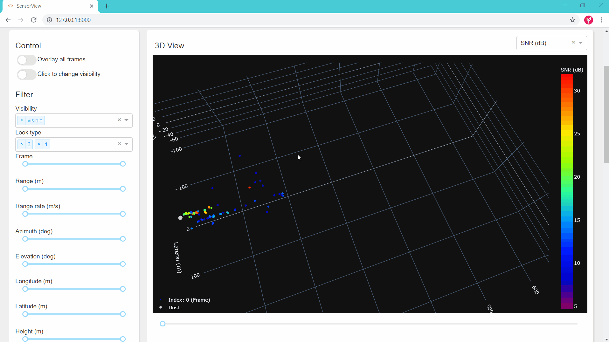
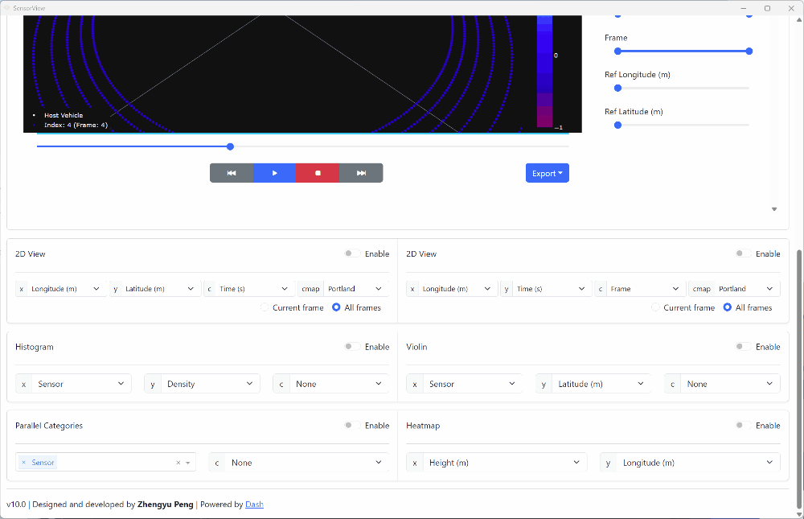

# SensorView


A Flask/Dash-based web application for sensor data visualization and analysis with advanced caching and interactive features.

## Screenshots

## Features

### Core Visualization Modes

#### 3D Visualization and Filtering

- Interactive 3D scatter plots for data visualization
- Advanced filtering and color mapping options
- Decay effects for temporal data analysis



#### 2D Visualization and Filtering

- Dual-panel 2D scatter plots (left and right views)
- Synchronized data filtering across multiple views
- Interactive data exploration tools


#### Statistical Visualization

- Heatmap visualization for correlation analysis
- Histogram analysis with customizable binning
- Parallel categories (parcats) for categorical data
- Violin plots for distribution analysis



### Advanced Features

- **Efficient Data Processing**: WebWorker-based caching system for smooth performance
- **Multiple File Support**: Load and compare multiple datasets simultaneously
- **Session Management**: Isolated data sessions for concurrent users
- **Interactive Controls**: Frame navigation, playback controls, and data updates
- **Dark/Light Mode**: Theme switching for different viewing preferences
- **Data Buffering**: IndexedDB-based client-side caching for large datasets
- **Configuration Persistence**: JSON-based configuration management
- **Test Case Management**: Organized data file and test case selection

## Architecture

### Server Components

- **Flask/Dash Server**: Main application server with REST API endpoints
- **REST API**: `/api/data/<session>/<start_index>` endpoint for streaming buffered frame data to the client
- **WebWorker Integration**: Client-side data management and processing
- **Cache Management**: Multi-level caching — server-side `diskcache` FanoutCache for session/frame data, client-side IndexedDB via WebWorker
- **Session Isolation**: Independent data sessions for multiple users

### Client Components

- **Interactive UI**: Modal dialogs for configuration and file selection
- **Dynamic Updates**: Automatic data refresh and visualization updates
- **IndexedDB Storage**: Browser-based data persistence and buffering

## Dependencies

### Python Modules

See `requirements.txt` for complete list:

- **dash**, **dash-bootstrap-components**, **dash-daq**: Web framework and interactive UI components
- **polars**, **pandas**, **numpy**, **pyarrow**: Data manipulation and analysis
- **diskcache**: Server-side FanoutCache for session and frame data
- **orjson**: High-performance JSON serialization for API responses
- **kaleido**: Static image export for plots
- **flaskwebgui**: Desktop application wrapper
- **waitress**: Production WSGI server (optional)

## Installation

1. Clone the repository:

```bash
git clone https://github.com/rookiepeng/sensorview.git
cd sensorview
```

2. Install Python dependencies:

```bash
pip install -r requirements.txt
```

## Usage

### Data Preparation

1. **Data Format**: Save data as `.pkl` (pickle) or `.csv` files
2. **Directory Structure**: Organize data under `./data` directory
3. **Configuration**: Create `info.json` in each test case directory

### Directory Structure Example

```
./data/
├── Example/
│   ├── info.json          # Required: Column specifications
│   ├── sensor_data.csv    # Data files
│   ├── test_results.pkl   # Alternative format
│   └── subfolder/         # Nested data organization
│       └── more_data.csv
└── Another_Test/
    ├── info.json
    └── dataset.pkl
```

### Configuration File (info.json)

Specify data column mappings, visualization settings, and metadata:

```json
{
  "slider": "Frame",
  "x_3d": "Latitude",
  "y_3d": "Longitude",
  "z_3d": "Height",
  "x_ref": "Host_Latitude",
  "y_ref": "Host_Longitude",
  "z_ref": "None",
  "keys": {
    "Height": {
      "description": "Height (m)",
      "decimal": 2,
      "type": "numerical"
    },
    "Longitude": {
      "description": "Longitude (m)",
      "decimal": 2,
      "type": "numerical"
    },
    "Latitude": {
      "description": "Latitude (m)",
      "decimal": 2,
      "type": "numerical"
    },
    "Time": {
      "description": "Time (s)",
      "decimal": 2,
      "type": "numerical"
    },
    "Sensor": {
      "description": "Sensor",
      "type": "categorical"
    },
    "Frame": {
      "description": "Frame",
      "decimal": 0,
      "type": "numerical"
    },
    "Host_Latitude": {
      "description": "Ref Latitude (m)",
      "decimal": 2,
      "type": "numerical"
    },
    "Host_Longitude": {
      "description": "Ref Longitude (m)",
      "decimal": 2,
      "type": "numerical"
    }
  }
}
```

**Configuration Parameters:**

- **slider**: Column to use for frame navigation/time slider
- **x_3d, y_3d, z_3d**: Default columns for 3D visualization axes
- **x_ref, y_ref, z_ref**: Reference point columns for 3D visualization; set to `"None"` (string) to disable a reference axis
- **keys**: Column definitions with metadata:
  - **description**: Human-readable column description
  - **decimal**: Number of decimal places for numerical display
  - **type**: Data type ("numerical" or "categorical")

### Running the Application

#### Development Mode

```bash
python app.py
```

Set `DEBUG = True` in app.py for development with hot reload.

#### Production Mode (Desktop App)

```bash
python app.py
```

The application will launch as a desktop application using FlaskWebGUI on port 8521.

#### Server Mode

Uncomment the Waitress server lines in app.py for production deployment:

```python
from waitress import serve
serve(app.server, listen="*:8000")
```

### Application Features

#### Configuration Modal

- **Data Path Selection**: Choose root directory for data files
- **Test Case Selection**: Pick from available test cases
- **File Selection**: Select specific data files to analyze
- **Settings Persistence**: Automatic configuration saving

#### Visualization Controls

- **Frame Navigation**: Manual frame selection or automatic playback
- **View Customization**: Toggle between different visualization modes
- **Color Mapping**: Customizable color schemes and mappings
- **Filtering**: Interactive data filtering and selection
- **Multi-file Comparison**: Load multiple files for comparative analysis

#### Data Management

- **Automatic Caching**: Server and client-side data buffering
- **Session Management**: Isolated data sessions
- **Dynamic Updates**: Automatic data refresh and synchronization
- **Performance Optimization**: IndexedDB storage for large datasets

## Development

### Callback Architecture

The application uses a modular callback system with separate modules for different views:

- `test_case_view`: Test case management
- `control_view`: Playback and navigation controls
- `scatter_3d_view`: 3D visualization callbacks
- `scatter_3d_view_background`: Background callback for pre-computing and buffering 3D frame data
- `scatter_2d_left_view` & `scatter_2d_right_view`: 2D visualization panels
- `heatmap_view`: Statistical heatmap visualization
- `histogram_view`: Distribution analysis
- `parcats_view`: Parallel categories visualization
- `violin_view`: Violin plot analysis

### Client-side Functions

The application includes several client-side callback functions for:

- WebWorker initialization and management
- IndexedDB data storage and retrieval
- Dynamic figure updates and buffering
- Performance optimization

## License

GPL-3.0 License - see LICENSE file for details.

## Contributing

Contributions are welcome! Please feel free to submit pull requests or open issues for bugs and feature requests.
