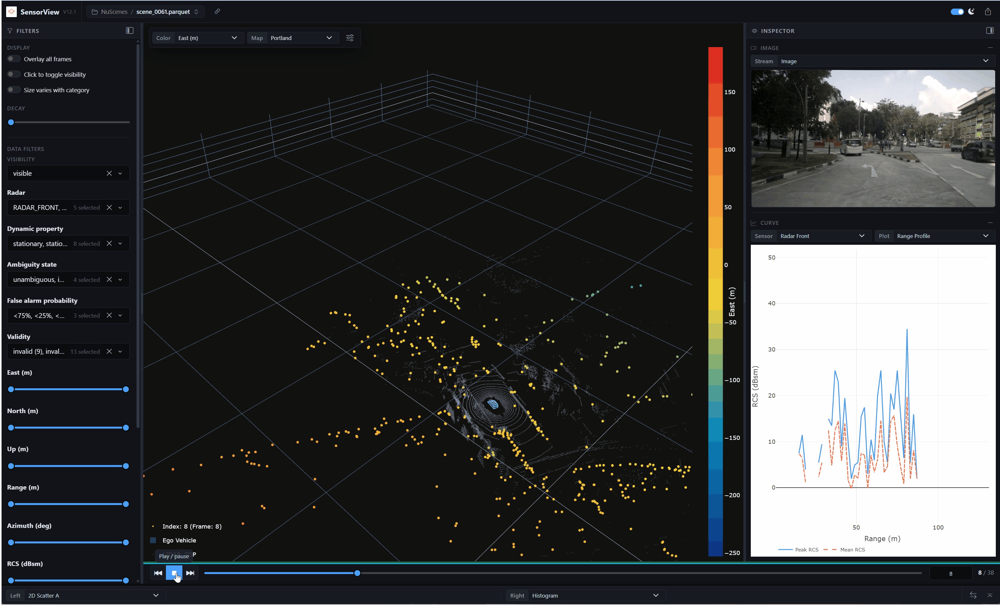

# SensorView


A Flask/Dash workbench for exploring multi-sensor logs. Its core purpose is
data analysis across three axes: **filtering** the frame table down to the
data that matters, **multi-dimensional inspection** of the same instant
through a 3D point cloud, camera frame, and 1D curves side by side, and
**statistical analysis** via six linked views — all driven by one frame
slider and one set of filters.

## Screenshots

The workbench on a nuScenes scene: the radar point cloud with its decimated
lidar backdrop and the ego-vehicle overlay, the camera frame and range profile
for the same instant in the inspector, and two statistical views in the dock.



## The Workbench

Everything is sized against the viewport rather than flowing down a page.
Nothing scrolls except panel interiors, so no view is ever more than a click
from visible — which is the point, since all of them describe the same frame.

| Region | Holds |
| --- | --- |
| **Top bar** | Dataset breadcrumb (it *is* the file picker), combine-logs, theme toggle, export menu |
| **Left rail** | Display options and the per-column filters built from the manifest |
| **Canvas** | The 3D point cloud — the only region that grows |
| **Inspector** | The camera stream and the curve plot for the current frame |
| **Transport** | Frame scrubbing, playback, buffering progress |
| **Analysis dock** | Two slots, each showing any one of the six statistical views |

The rail, inspector, and dock each have a splitter on their inner edge; whatever
they give up, the canvas takes. Collapse, drag, and theme all run clientside
(`assets/workbench.js`) — none of it is anything the server knows about.

### 3D Canvas

Interactive 3D scatter with color mapping, a decay slider that fades previous
frames in behind the current one, and an overlay mode that draws every frame at
once. View settings float over the plot instead of docking above it, since
they're touched only a few times a session. Axis and reference-column mapping
live behind the sliders button.

### Filter Rail

Filters are generated per column from the manifest — a range slider for each
numerical key, a multi-select for each categorical one. Every view reads the
same filtered table, so a filter change moves all of them together. Points can
be relabelled *hidden* by clicking or lassoing them, then filtered on that
label.

### Inspector

The camera stream and curve plot for the current frame, docked on the right.
Each section has its own minimize toggle and restores from a chip in the panel
bar; the curve section grows into whatever height the image gives up. Sections
hide independently, and the whole inspector hides when a log has neither
sidecar, so the canvas reclaims the width.

### Analysis Dock

Two side-by-side slots over a drag-resizable panel that collapses to its own
header. Each slot shows one of six views:

- **2D Scatter A / B** — two independent x/y/color mappings, with lasso and box
  selection wired to the visibility label
- **Histogram** — one column binned, normalized as density or probability,
  optionally split by a category
- **Violin** — distribution by category
- **Parallel Categories** — categorical relationships
- **Heatmap** — 2D density

Slot assignment is the enable switch: a view in a slot is live, everything else
is idle, and a collapsed dock computes nothing.

### Transport and Buffering

The frame slider is the single source of truth for time: the video element
never plays on its own, it's seeked to whatever frame the rest of the app
shows, and playback runs the same path. Server- and browser-side buffering
progress ride as two hairlines on the transport's top edge, visible when
looked for.

### Other

- **Multiple File Support**: combine additional logs from the top bar and
  compare them in one view
- **Session Isolation**: each browser session gets its own cache namespace
- **Data Buffering**: a WebWorker pre-fetches frames into IndexedDB so scrubbing
  does not wait on the server
- **Dark/Light Theme**: chrome and Plotly templates switch together; the choice
  persists in `localStorage`
- **Export**: current plot as PNG or HTML, all frames as an HTML video, or the
  filtered data itself as Parquet for the current frame or all frames

---

## Data Architecture

Each kind of sensor data gets the storage format that suits its shape, joined by
a single **frame id**:

| Data | Format | Filterable | Updates on |
| --- | --- | --- | --- |
| Table (`table`) | Parquet (tidy table) | **Yes** — full filter pipeline | filter changes + frame changes |
| Cloud (`cloud`) | HDF5, pre-decimated | No — fixed backdrop | frame changes only |
| Curves (`curve`) | HDF5, one (N, 2) pair per frame | No | frame changes only |
| Images (`image`) | mp4, all-intra | No | frame changes only |
| Reference pose (`reference`) | Parquet, one row per frame | No | frame changes only |

The reasoning behind the split:

- **The table is the only queried dataset**, so it stays columnar: Parquet gives
  compression plus projection/predicate pushdown, and MATLAB reads it natively
  (`parquetread`/`parquetwrite`).
- **Cloud and curves are display-only**, frame-indexed blobs — nobody queries
  them by column, so a chunked HDF5 dataset per frame (equally native in
  MATLAB via `h5read`) beats Parquet's columnar overhead.
- **Clouds arrive pre-decimated**; the backdrop has no runtime controls, so no
  full-resolution data is kept on the read path.
- **Images are seeked client-side** via a native `<video>` element and
  `currentTime`, so scrubbing costs no server round trip. All-intra encoding
  lets the browser seek to any frame; a container it can't play (a vendor
  `.avi` off a logger) is transcoded once, on first request, and cached under
  `cache/video`.
- **Reference pose is per frame, not per detection** — six extra columns on
  every one of a log's 300k rows to say where one vehicle was would be
  wasteful, and table columns can't express orientation anyway.

Because the display-only views never depend on filter state, dragging a filter
slider re-renders the table alone — it never re-reads the cloud, curves, pose, or
video.

**SensorView reads these files; it does not write them.** Producing the
layout is the job of whatever exports the data. The complete on-disk
contract — exact filenames, HDF5 paths, dtypes, and every manifest key, plus
a worked converter and a validation checklist — lives in
[DATA_FORMAT.md](DATA_FORMAT.md).

---

## Installation

1. Clone the repository:

```bash
git clone https://github.com/rookiepeng/sensorview.git
cd sensorview
```

1. Install Python dependencies:

```bash
pip install -r requirements.txt
```

## Usage

### Preparing Data

1. Put each case in its own folder under `./data` (or point the app at any
   other directory from the open dialog).
2. Give the case an `info.json` — see the [manifest
   reference](DATA_FORMAT.md#infojson-reference), or the [minimal
   manifest](DATA_FORMAT.md#minimal-manifest) to start from.
3. Drop the logs in: `<stem>.parquet` plus whatever sidecars exist for it.
   Anything missing simply does not appear.

The file picker offers `.parquet` tables only. A v1 `info.json` with its keys at
the top level still loads and is upgraded in memory, but a `.csv` or `.pkl`
table has to be converted first — see
[Writing a Converter](DATA_FORMAT.md#writing-a-converter).

### Bundled cases

- **`data/NuScenes`** — five logs built from the nuScenes v1.0-mini split, with
  every block filled in: a decimated lidar backdrop, six curve sources across
  five radars plus the lidar, two camera streams, and a per-frame ego pose the
  host mesh turns with. `README.txt` in that folder documents what each column
  holds; `build_nuscenes_case.py` rebuilds the whole case from the original
  archive. The data is derived from nuScenes and carries **CC BY-NC-SA**
  (non-commercial) terms, not this repository's GPL-3.0.

### Running the Application

#### Desktop app

```bash
python main.py
```

Waitress serves the app on `127.0.0.1:8521` and pywebview shows it in a native
window -- WebView2 on Windows, WKWebView on macOS, WebKitGTK on Linux. Closing
the window ends the process.

The window brings native dialogs with it: the browse button beside the data path
in the open dialog, and a save dialog for every export, which asks where the
file should go rather than dropping it in the downloads folder. Served to a
browser instead, the browse button is disabled and the path is typed.

On Linux the GTK bindings are system packages rather than wheels, so a window
there needs `pip install "pywebview[gtk]"` alongside `gir1.2-webkit2-4.1` and
`python3-gi`. Without them SensorView opens in the default browser instead, and
has to be stopped with Ctrl+C rather than by closing the window.

#### Development

Set `DEBUG = True` in `main.py` for the Dash dev server with hot reload.

#### Server

`dash_app.py` exposes a wired `app` that any WSGI server can host, so a deployment
skips `main.py` and its window entirely:

```python
from waitress import serve
from dash_app import app

serve(app.server, listen="*:8000")
```

## Architecture

### Server Components

- **Flask/Dash Server**: main application server with REST API endpoints
- **REST API**: `/api/data/<session>/<start_index>` streams buffered frame data
  to the client, `/api/cloud/<session>/<frame>` serves the decimated backdrop,
  and `/api/camera/<session>/<log>/<stream>` serves (and, if needed, transcodes)
  one log's video
- **Background Callbacks**: 3D frames are pre-computed off the request thread
  through a `diskcache` job manager, with cooperative cancellation when a newer
  request supersedes an in-flight one
- **Cache Management**: multi-level — server-side `diskcache` FanoutCache for
  session/frame data, client-side IndexedDB via WebWorker
- **Session Isolation**: independent data sessions for multiple users

### Client Components

- **Workbench chrome** (`assets/workbench.js`): panel collapse, splitter drags,
  theme persistence, and the Plotly re-fit that follows any layout change
- **WebWorker** (`assets/worker.js`): pulls frames from the REST API and stores
  them in IndexedDB ahead of the slider
- **Clientside callbacks** (`assets/client_side.js`): worker startup, figure
  swapping from the local buffer, and a bounded in-memory cache of cloud
  backdrops so revisiting a frame costs nothing

## Dependencies

### Python Modules

See `requirements.txt` for the complete list:

- **dash**, **dash-bootstrap-components**, **dash-daq**: web framework and interactive UI components
- **polars**, **pandas**, **numpy**, **pyarrow**: data manipulation and Parquet I/O
- **h5py**: HDF5 sidecars for point clouds and 1D curves
- **imageio-ffmpeg**: bundles a static ffmpeg, used to count a recording's frames, extract the stills the HTML export inlines, and transcode containers a browser cannot play
- **diskcache**: server-side FanoutCache for session and frame data
- **orjson**: high-performance JSON serialization for API responses
- **kaleido**: static image export for plots
- **pywebview**: native window shell for the desktop app
- **waitress**: WSGI server behind that window
- **waitress**: production WSGI server (optional)

## Development

### Top-level Modules

Which file does what, and which one starts the app:

| Module | Role |
|---|---|
| `main.py` | **The entry point.** The only module with a `__main__`; `python main.py` runs the app. |
| `dash_app.py` | Assembles the Dash application — layout, clientside callbacks, and the registration of every callback module. Exposes `app` for a WSGI server; starts nothing on import. |
| `settings.py` | The Dash instance, the disk caches, and the shared constants every module reads. |
| `routes.py` | The plain HTTP endpoints the browser fetches outside Dash's callback protocol. |
| `desktop.py` | Hosts a running server in a native window. Imported by `main.py`, never run directly. |
| `frame_sources/` | Resolves a session's manifest, logs, and per-frame sidecar data. One module per store; see below. |
| `process_frame.py` | Filtering and figure construction for one frame. |
| `utils.py` | Cache helpers and `config.json` persistence. |

Nothing but `main.py` runs on its own, and nothing starts a server on import —
which is what lets background-callback workers re-import these modules safely.

### Layout Package (`layouts/`)

One module per region of the shell:

- `app_layout`: the shell itself — which region owns what, and the stores the
  views coordinate through
- `topbar_layout`: brand, dataset breadcrumb, combine-logs, theme, export
- `filter_panel_layout`: the collapsible left rail
- `canvas_layout`: the 3D stage, its floating controls, and the transport
- `inspector_layout`: the camera and curve sections of the right dock
- `analysis_dock_layout`: the two-slot bottom dock and the six panes it hosts
- `modal_layout`: the open-dataset dialog and the load-failure dialog

### Callback Architecture

A modular callback system, one module per view:

- `file_modal_view`: the open-dataset dialog — data path, case, and log choice
- `test_case_view`: dataset loading, and the filter rail it builds
- `control_view`: playback and navigation controls
- `scatter_3d_view`: 3D visualization callbacks
- `scatter_3d_view_background`: background callback pre-computing and buffering
  3D frame data
- `scatter_2d_left_view` & `scatter_2d_right_view`: the two 2D scatter panes
- `heatmap_view`: statistical heatmap visualization
- `histogram_view`: distribution analysis
- `parcats_view`: parallel categories visualization
- `violin_view`: violin plot analysis
- `camera_view`: mp4 stream selection, clientside frame-exact seeking, and
  inspector visibility
- `threshold_view`: per-frame 1D curve plot rendering

### Frame Sources Package (`frame_sources/`)

Bridges the session cache to the `dataio` stores, one module per store. The
table is refiltered whenever a filter changes; everything here is display-only
and re-reads only when the frame changes.

- `session`: which manifest a session holds, and which log owns each slider
  position once several are combined — the only module the other four depend on
- `cloud`: the point-cloud backdrop
- `reference`: the moving origin and the axis bounds that follow it
- `image`: camera streams, transcoding, and the stills the HTML export inlines
- `curve`: per-frame 1D curves and their held y ranges

`__init__` re-exports the public names, so callers import from the package.

### Data IO Package (`dataio/`)

- `manifest`: `info.json` v2 parsing, v1 upgrade, basename sidecar resolution,
  curve plot definitions, non-destructive persistence
- `frames`: frame ids derived from the Parquet data
- `radar_store`: Parquet table loading with projection/predicate pushdown
- `reference`: per-frame reference pose from a Parquet sidecar, with the
  configurable column mapping
- `dense_store`: HDF5 readers for cloud points and 1D curves
- `calibration`: extrinsics → 4×4 transform for cross-sensor alignment
- `video`: on-demand transcoding of foreign containers

## License

GPL-3.0 License - see LICENSE file for details.

## Contributing

Contributions are welcome! Please feel free to submit pull requests or open issues for bugs and feature requests.
