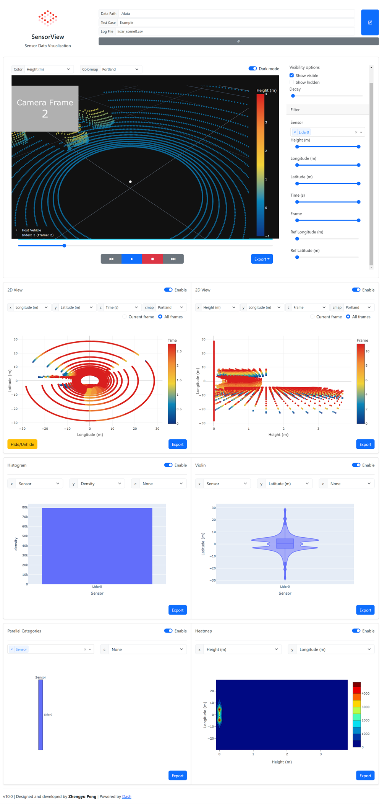

# SensorView


A lightweight sensor data visualization and analysis tool.

## Screenshots



## Features

### 3D Visualization and Filtering


### 2D Visualization and Filtering


### Statistical Visualization


## Dependence

### Python modules

- dash
- dash-daq
- dash-bootstrap-components
- flask
- numpy
- pandas
- redis
- kaleido
- gevent
- celery
- gunicorn

pip install -r requirements.txt

### [Redis](https://redis.io/)

```bash
conda install -c anaconda redis
```

## Usage

Save data as the `.pkl` or `.csv` files under `./data` directory. See `./data/Example`.

Put the `config.json` in the same directory, and specify the `columns` of the data in `config.json`. Check `./data/Example/config.json`.

### Local

```bat
start_standalone.bat
```

- Open `http://127.0.0.1:8050/` in a browser

### Docker

```bash
$ docker pull redis
$ docker pull rookeiepng/sensorview
$ docker run --name redis -d redis
$ docker run -it -p 8000:8000 -v <path/to/your/data>:/usr/src/app/data --link redis:redis rookiepeng/sensorview
```

- Open `http://127.0.0.1:8000/` in a browser

### Debug

```
$ redis-server
$ celery -A tasks worker --loglevel=info -P gevent
$ python app.py
```

- Open `http://127.0.0.1:8050/` in a browser
